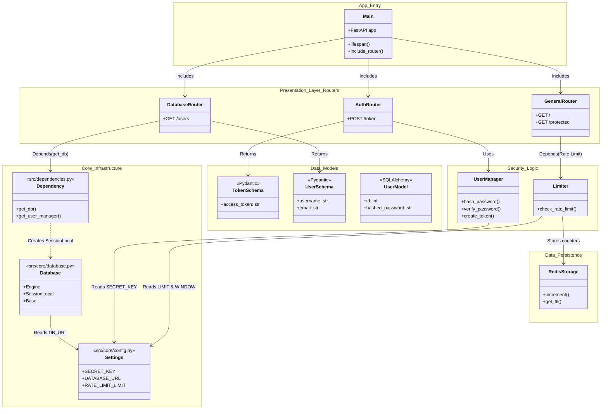

```mermaid
    classDiagram
    %% --- RELATIONSHIPS ---

    %% Main binds everything together
    Main --> AuthRouter : Includes
    Main --> DatabaseRouter : Includes
    Main --> GeneralRouter : Includes

    %% Routers use Dependencies & Logic
    AuthRouter --> UserManager : Uses
    AuthRouter --> TokenSchema : Returns
    
    DatabaseRouter --> Dependency : Depends(get_db)
    DatabaseRouter --> UserSchema : Returns

    GeneralRouter --> Limiter : Depends(Rate Limit)

    %% Core Infrastructure
    Dependency ..> Database : Creates SessionLocal
    Database --> Settings : Reads DB_URL
    UserManager --> Settings : Reads SECRET_KEY
    Limiter --> Settings : Reads LIMIT & WINDOW
    Limiter --> RedisStorage : Stores counters

    %% --- DEFINITIONS ---

    namespace App_Entry {
        class Main {
            +FastAPI app
            +lifespan()
            +include_router()
        }
    }

    namespace Presentation_Layer_Routers {
        class AuthRouter {
            +POST /token
        }
        class DatabaseRouter {
            +GET /users
        }
        class GeneralRouter {
            +GET /
            +GET /protected
        }
    }

    namespace Core_Infrastructure {
        class Settings {
            <<src/core/config.py>>
            +SECRET_KEY
            +DATABASE_URL
            +RATE_LIMIT_LIMIT
        }
        class Database {
            <<src/core/database.py>>
            +Engine
            +SessionLocal
            +Base
        }
        class Dependency {
            <<src/dependencies.py>>
            +get_db()
            +get_user_manager()
        }
    }

    namespace Security_Logic {
        class UserManager {
            +hash_password()
            +verify_password()
            +create_token()
        }
        class Limiter {
            +check_rate_limit()
        }
    }

    namespace Data_Persistence {
        class RedisStorage {
            +increment()
            +get_ttl()
        }
    }

    namespace Data_Models {
        class UserSchema {
            <<Pydantic>>
            +username: str
            +email: str
        }
        class TokenSchema {
            <<Pydantic>>
            +access_token: str
        }
        class UserModel {
            <<SQLAlchemy>>
            +id: int
            +hashed_password: str
        }
    }
```