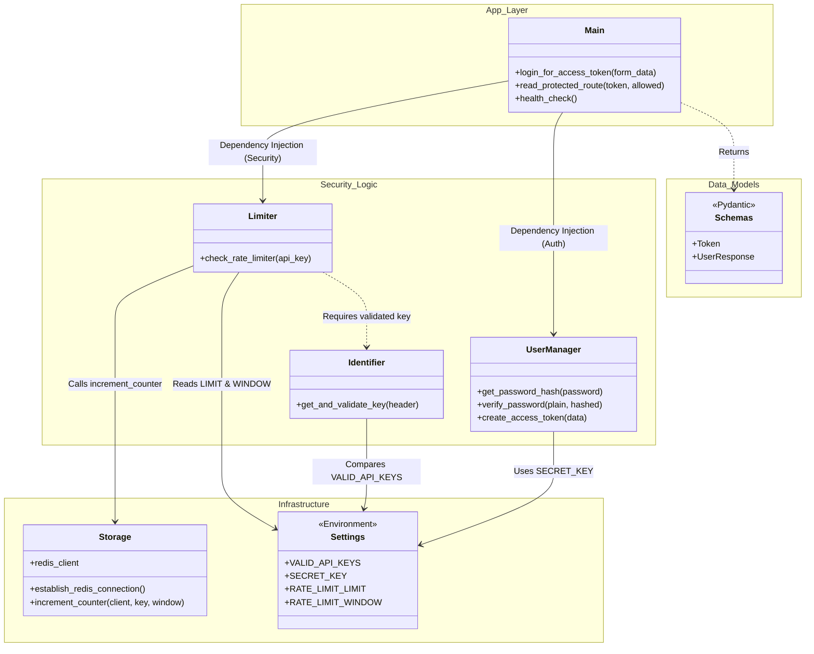

```mermaid
    classDiagram

    Main ..> Schemas : Returns
    Main --> UserManager : Dependency Injection (Auth)
    Main --> Limiter : Dependency Injection (Security)

    Limiter ..> Identifier : Requires validated key
    Limiter --> Storage : Calls increment_counter
    Limiter --> Settings : Reads LIMIT & WINDOW

    Identifier --> Settings : Compares VALID_API_KEYS
    UserManager --> Settings : Uses SECRET_KEY

    namespace App_Layer {
        class Main {
            +login_for_access_token(form_data)
            +read_protected_route(token, allowed)
            +health_check()
        }
    }

    namespace Security_Logic {
        class UserManager {
            +get_password_hash(password)
            +verify_password(plain, hashed)
            +create_access_token(data)
        }
        class Limiter {
            +check_rate_limiter(api_key)
        }
        class Identifier {
            +get_and_validate_key(header)
        }
    }

    namespace Infrastructure {
        class Storage {
            +redis_client
            +establish_redis_connection()
            +increment_counter(client, key, window)
        }
        class Settings {
            <<Environment>>
            +VALID_API_KEYS
            +SECRET_KEY
            +RATE_LIMIT_LIMIT
            +RATE_LIMIT_WINDOW
        }
    }

    namespace Data_Models {
        class Schemas {
            <<Pydantic>>
            +Token
            +UserResponse
        }
    }

```