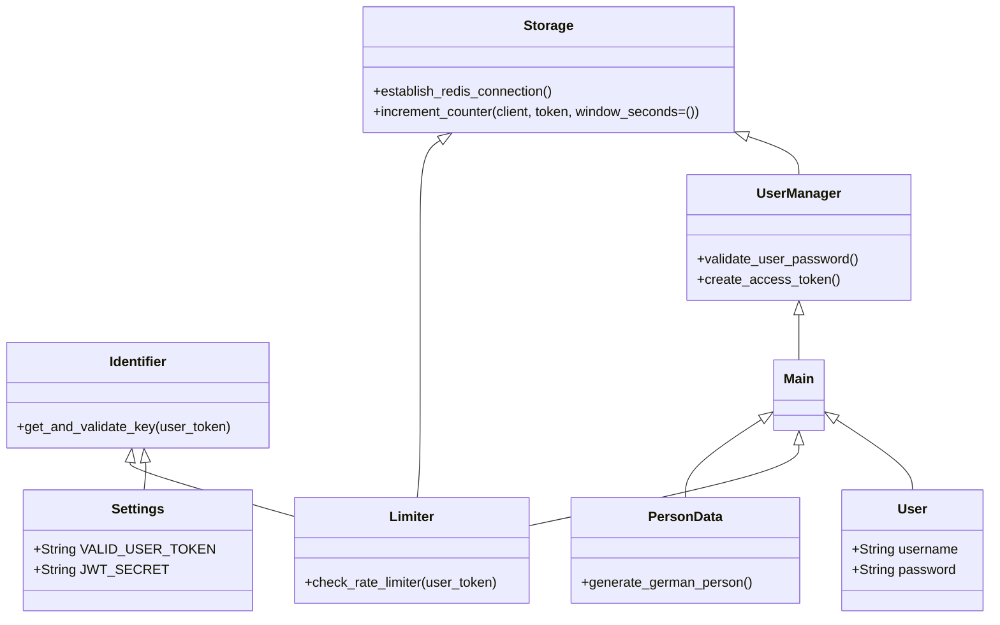

```mermaid
    classDiagram
        Storage <|-- Limiter
        Identifier <|-- Limiter
        Identifier <|-- Settings
        Main <|-- PersonData
        Main <|-- Limiter
        Main <|-- User
        UserManager <|-- Main
        Storage <|-- UserManager

        class Limiter{
            +check_rate_limiter(user_token)
        }
        class Identifier{
            +get_and_validate_key(user_token)
        }
        class Settings{
            +String VALID_USER_TOKEN
            +String JWT_SECRET
        }
        class Storage{
            +establish_redis_connection()
            +increment_counter(client, token, window_seconds=())
        }
        class PersonData{
            +generate_german_person()
        }
        class Main{
            
        }
        class User{
            +String username
            +String password
        }
        class UserManager{
            +validate_user_password()
            +create_access_token()
        }

```