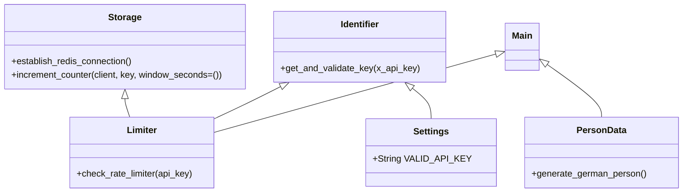

```mermaid
    classDiagram
        Storage <|-- Limiter
        Identifier <|-- Limiter
        Identifier <|-- Settings
        Main <|-- PersonData
        Main <|-- Limiter

        class Limiter{
            +check_rate_limiter(api_key)
        }
        class Identifier{
            +get_and_validate_key(x_api_key)
        }
        class Settings{
            +String VALID_API_KEY
        }
        class Storage{
            +establish_redis_connection()
            +increment_counter(client, key, window_seconds=())
        }
        class PersonData{
            +generate_german_person()
        }
        class Main{
            
        }

```