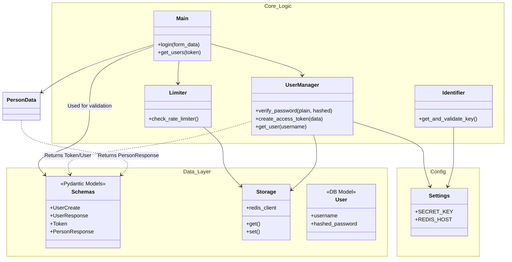

```mermaid
    classDiagram
    %% Relationer
    Main --> Schemas : Used for validation
    Main --> UserManager
    Main --> Limiter
    Main --> PersonData
    
    Limiter --> Storage
    UserManager --> Storage
    UserManager --> Settings
    Identifier --> Settings
    
    %% Beroenden för data
    UserManager ..> Schemas : Returns Token/User
    PersonData ..> Schemas : Returns PersonResponse

    namespace Core_Logic {
        class Main{
            +login(form_data)
            +get_users(token)
        }
        class UserManager{
            +verify_password(plain, hashed)
            +create_access_token(data)
            +get_user(username)
        }
        class Limiter{
            +check_rate_limiter()
        }
        class Identifier{
            +get_and_validate_key()
        }
    }

    namespace Data_Layer {
        class Schemas{
            <<Pydantic Models>>
            +UserCreate
            +UserResponse
            +Token
            +PersonResponse
        }
        class User{
            <<DB Model>>
            +username
            +hashed_password
        }
        class Storage{
            +redis_client
            +get()
            +set()
        }
    }

    namespace Config {
        class Settings{
            +SECRET_KEY
            +REDIS_HOST
        }
    }

```