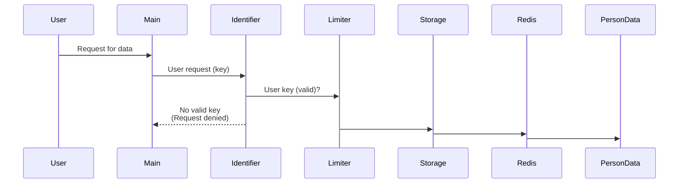

```mermaid
    sequenceDiagram 
        User ->> Main: Request for data 
        Main ->> Identifier: User request (key)
        Identifier ->> Limiter: User key (valid)?
        Identifier -->> Main: No valid key <br> (Request denied)
        Limiter ->> Storage:
        Storage ->> Redis:
        Redis ->> PersonData:


```